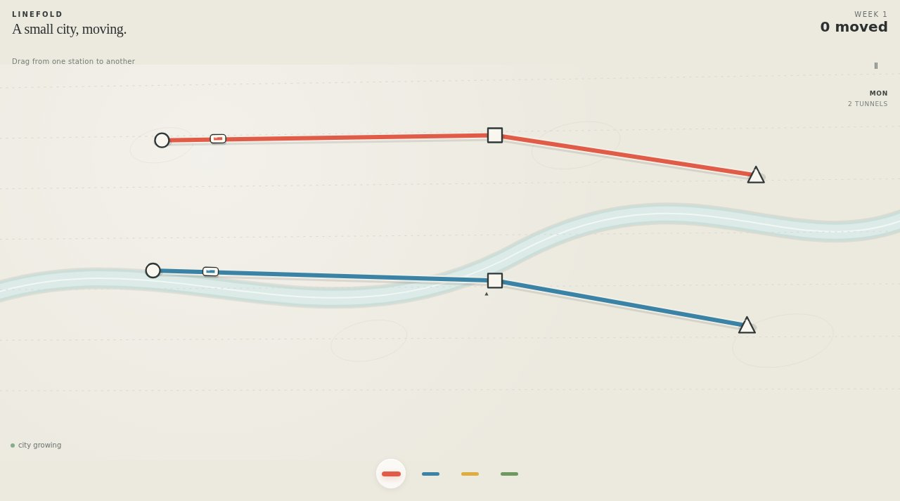

# Linefold

A small city, moving. An original subway design game.



**Live:** https://aeiouvcode.github.io/linefold/

## About

Drag between stations to lay lines. The city grows every day and passengers pile up; if a station overflows, the week is over. At the end of each week choose an upgrade: an extra carriage, a new train, a bigger interchange or more tunnels under the river.

## Built with

Canvas 2D and Web Audio in one `index.html`. No dependencies.

## Run locally

```sh
git clone https://github.com/aeiouvcode/linefold.git
cd linefold
python3 -m http.server 8000
```

Then open http://localhost:8000.
